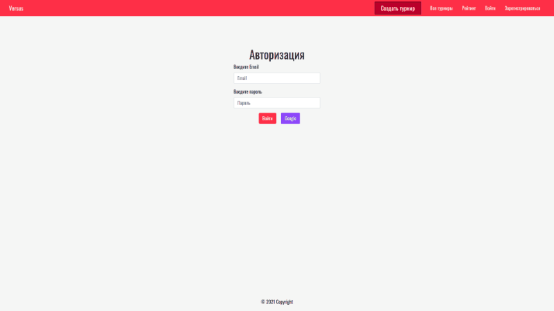
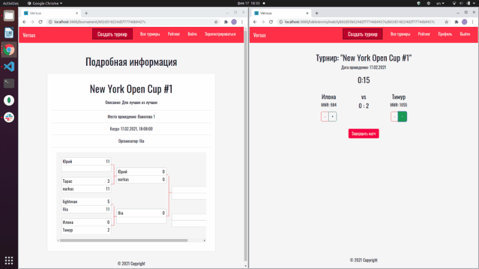
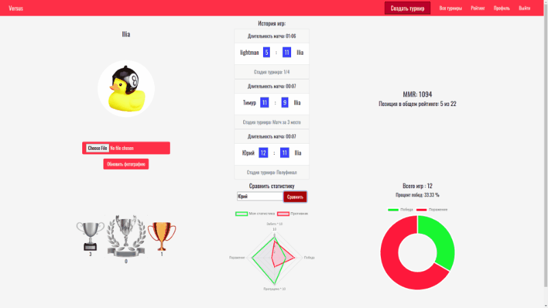

# Versus

Веб-приложение для создания, проведения и участия в турнирах по настольному теннису

### Стек технологий
* React
* Redux-Thunk
* Express
* Node.js
* MongoDB Atlas
* WebSocket
* Passport.js
* React-beautiful-dnd
* Chart.js
* Bootstrap

### Запуск проекта
1. Перейти в корневой каталог проекта
2. В командной строке выполнить (однократно для установки): 
```sh
npm install
```
3. Переименовать .env.sample в .env (в папке client и папке server) и заполнить поля:
```sh
REACT_APP_SERVER_URL= url адрес сервера
REACT_APP_GOOGLE_ID= ключ гугл для авторизации через Passport JS
REACT_APP_GOOGLE_CLIENT_SECRET= secret для авторизации через Passport JS 
REACT_APP_URL= url адрес приложения

GOOGLE_ID= ключ гугл для авторизации через Passport JS
GOOGLE_CLIENT_SECRET= secret для авторизации через Passport JS 
SERVER_URL= url адрес сервера
ATLAS= ссылка для подключения к базе данных Atlas
```
4. Запуск проекта:
```sh
npm start
```
### Описание функционала приложения
У зарегистрированного пользователя есть возможность как принять участие в грядущем турнире, так и стать его организатором. Организатор мероприятия имеет возможность завершить запись, если число участников больше 4-х человек. Если набралось нечетное количество записавшихся и кому-то не достается пары, то участники с наивысшим рейтингом автоматически пройдут в следующую стадию турнира. Рейтинговая система основана на шахматной системе Эло.

#### Главная страница
Только авторизованный пользователь может создать собственный турнир. Есть возможность быстрой регистрации через Google.



#### Турнир
Результаты матча динамически меняются в режиме реального времени благодаря технологии WebSocket.



#### Страница профиля
Технология React-beautiful-dnd дает возможность каждому пользователю настроить личный кабинет на свой вкус.



#### Планы по развитию проекта
* Выбор вида спорта
* Больше вариаций турнирной сетки
* Мобильная версия приложения

### Наша команда
* [Аркадий Кузнецов](https://github.com/Kuzzarvi)
* [Дьячков Юрий](https://github.com/YuriyDyachkov)
* [Виктор Резник](https://github.com/Vict0rFrost)
* [Илья Сирцев](https://github.com/SyrtsevIV)
